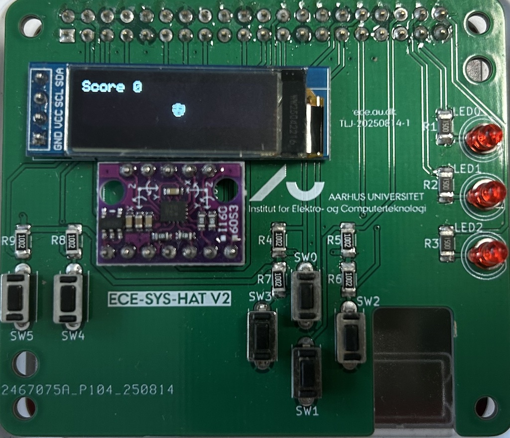
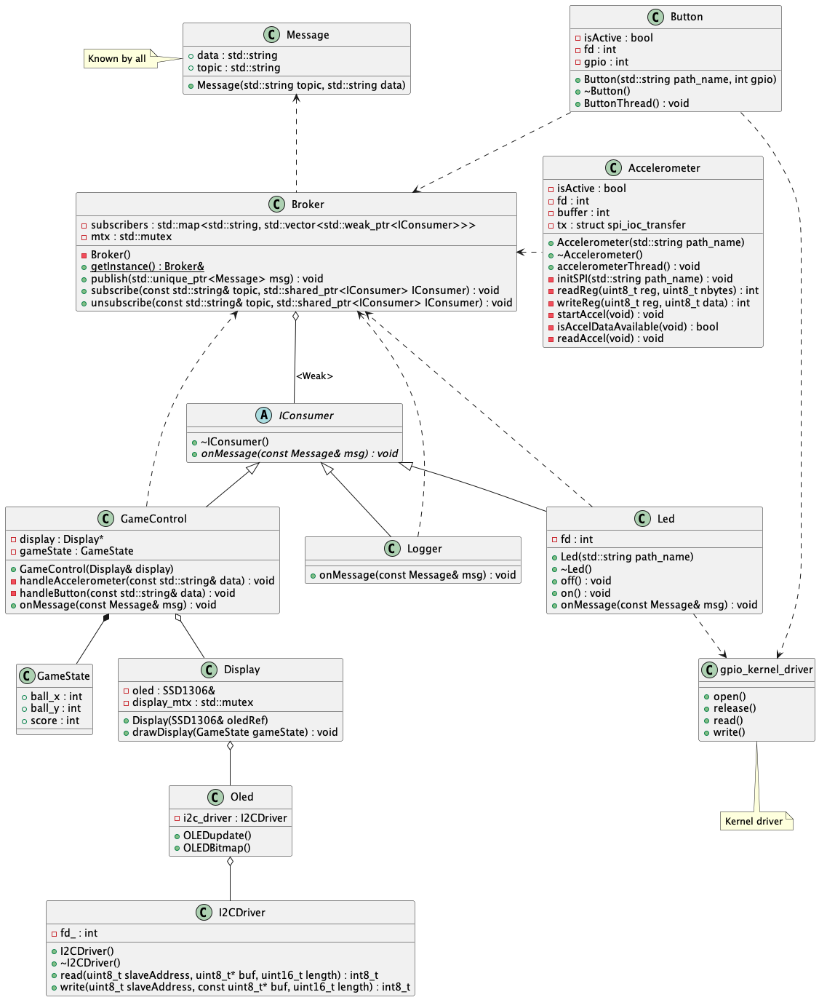

# Exercise: Balance Ball

This exercise exemplifies the use of Posix file I/O and a messaging system to implement a basic balancing ball game on your Raspberry Pi. 

*In the following, the hand-in requirements, the game scenario, and the provided hardware and software will be presented. This is followed by the activities that you must do to solve the exercise.*

### Focus

* Writing a character driver
* Writing a SPI-based user-space driver
* User-space GPIO access using Posix I/O
* Working with a message distribution system   

## Prerequisites

You must [fork](https://www.geeksforgeeks.org/git/how-to-fork-a-project-in-gitlab/) this repository to you own Gitlab group and clone that version on your RPI. 

To communicate with the OLED display and the BMI160 accelerometer, you must install the require libraries on your RPI. You can find files and instructions here: [gitlab.au.dk/platforms/rpi5/ecesyshat/](https://gitlab.au.dk/platforms/rpi5/ecesyshat/-/tree/main/Libraries?ref_type=heads)

**Note!!** If you have already installed the libraries, please try and pull from the repository once more to see if there are updates, if so, build and install the latest version!!

## Approval

This exercise must be handed-in.
You must hand-in a PDF on FeedbackFruits containing the following:
* Front page with group number and members plus **link to your gitlab repo** (**DOUBLE CHECK THAT IT WORKS!!**)
* Non-code stuff requested in the exercise, e.g. design descriptions, diagrams a.o.

Your Gitlab repository must contain:
* Code for your solution
* Makefile / CMakeLists.txt to build your project   

To have your hand-in approved you must also peer-review a fellow student's submission. You can find the review criteria at the end of this page. Your submission occupies 75% of the grade, the review 25%.

## Balancing Ball

You are tasked with building a simple **Balancing ball game** on a Raspberry Pi, displayed on a small **OLED screen**. The ball is controlled by an accelerometer and moves according to how it is tilted* (and held). The score is accumulated over time, the more tilt, the more faster it increases. If the ball hits the boundary of the screen, an LED will light up and the score is decremented. Pressing a button, the ball will be centered and score reset. Some of the code will be provided to kick-start your work, but you will have to implement several classes and also drivers to the hardware.

*) A Gyroscope outputs the angular change, whereas an accelerometer outputs acceleration, including gravity. Holding the RPI still at an angle (tilted) will produce an accelerometer output, but no gyro output. To get the actual orientation while moving, you need both sensors, but we'll neglect the gyro part for this exercise.

### Game Requirements

* The ball starts at the center of the screen.
* Accelerometer tilt moves the ball left/right/up/down.
* Pressing the button will center ball and reset score.
* If the accelerometer is held horizontal, score will not increase.
* The more the accelerometer is tilted, the faster the score increases.
* If the ball hits the screen boundary, the score is decremented and the LED lights up.

Beside these requirements, you are allowed to create additional rules :-)

---

### Hardware Design

The ECE-SYS-HAT provides six buttons (switches), three LEDs, accelerometer, and an OLED dislay.

#### Buttons

You'll see the names of the buttons printed on the printed circuit board (PCB) as seen below. We need this information to assign the buttons to the correct game functions. All buttons are active-low ('0' is active).



#### Display

The Display is an 128 x 32 pixel OLED display. 

The pixels are oriented from the upper-left corner:

```
(0, 0) ---------- (127,0)
      |          |
      |          |
(0,31) ---------- (127,31)
```

To move the ball *right*, you must *increment* the x-position. To move the ball *up*, you must *decrement* the y-position.

The ball is 8x8 pixels and uses a similar orientation.

This means that placing the ball at (0,0) will place the ball's upper-left corner in the display's upper-left corner. Placing the ball at (27,0) will place the ball's bottom seven pixel rows below the visible area of the screen. You will get run-time warnings if you place bitmaps outside the screen area.

---

### Software Design

This design uses two threads, one for each input, accelerometer and button. The classes as shown in the Class Diagram below. 



The game is assembled and started in *balance_ball.cpp*

#### `Accelerometer`

This boundary class initializes the accelerometer, reads it at a fixed time interval  and publishes its values to the broker.

You must implement its functionality.

#### `Broker`

The central message broker Singleton. Provides the `subscribe` and  `publish` methods. 

#### `Button`

Takes button (gpio) input and publishes it to the broker.

*You must implement its functionality.**

#### `Display`

Updates the Display with ball position and score.

#### `GameControl`

Listens to accelerometer and button messages, updates ball movements and score accordingly, and calls the `Display` to update the screen.

*You must implement part its functionality.*

#### `Message`

The `Message` struct holds a topic and data field. Both fields are of string type. The data string contains comma separated values. `Message` also contains static functions to encode and decode different message types.

#### `I2CDriver`

Implements I2C communication to the OLED screen to be used by the OLED library.

#### `Led`

This boundary class controls the LED.

*You must implement its functionality.*

#### `Logger`

Dumps all subscribed messages to `cout`.

#### `main` (balance_ball)

The main loop does the following:
* Initialize I2C and OLED library
* Initialize SPI driver and accelerometer library
* Instantiate objects
* Add subscriptions
* Start and join threads

*You must implement its functionality.*

---

### Activities

To implement the missing parts of the game, the following activities must be completed.

The source code given should compile on your Raspberry Pi right out-of-the-box. Try to compile and launch the application before working on the activities to ensure you are set-up correctly.

#### Activity 1: Get GPIO driver up and running

For this part you must use your GPIO driver from the *Linux Device Driver* exercise.

**Task 1:**
Build and `insmod` your GPIO driver. Note the names of your devices in `/dev` e.g. `/dev/mygpio-btn` and `/dev/mygpio-led`. 

Check that they work before continuing to the next activity.

**Note!** You have to insmod the driver each time you reboot your Raspberry Pi.

#### Activity 2: Implement `Button` Class

**Task 1:**
Implement the constructor for the `Button`. It must open the device node in `/dev` using Posix `open` and store the file descriptor.

**Task 2:**
Implement the destructor for the `Button`. It must close the device node using Posix `close` (Implementing RAII).

**Task 3:** Implement `buttonThread`. The thread must run at a fixed interval and do the following:
  * Read the button value using Posix `read()`.
  * Create a Button message, with topic **`btn`** and data encoded with `Message::encodeButtonData()`. Use the value read from the gpio.
  * Publish the button message to the `Broker`.

**Note!** Since `Broker::publish()` takes a `std::unique_ptr<Message> msg` you must create your message using `std::make_unique` and you must use `std::move` to move its ownership to the broker when calling `publish`.

**Task 4:** Build and test

Build the project. If successful, you should see the `Logger` writing the topic and message button status to `cout` and the consumer in `GameControl::handleButton` writing "RESET" to `cout`, when pressing the button.

#### Activity 3: Implement `Accelerometer` Class

In lecture *11.2 I/O Wrap-up* you were given the example code *gyro_tilt.cpp*. This example code let's you initialize and read gyroscopic values from the BMI160 using user-space SPI access.

The BMI160 also provides accelerometer data, so let's convert the *gyro_tilt.cpp* example into real C++ classes and read acceleration data instead.

The headerfile for the class is already given in *accelerometer.hpp*. Similarly to `Button` the constructor takes a file path, in this case we will use the path for spidev, `/dev/spidev0.0`, when instantiating the Accelerometer in `main()`.

The following tasks will take you through the methods of `Accelerometer` that you must implement, based on the *gyro_tilt.cpp* example.

**Task 1:** Implement `Accelerometer::initSPI`

Same as example, except pathname must be passed as parameter and used in `open()`. Note that `open()` uses a c-string type for pathname, not an `std::string`.

**Task 2:** Implement `Accelerometer::readReg` and `Accelerometer::writeReg`

Same as in example

**Task 3:** Implement `Accelerometer::startAccel`

Same as `startGyro` in the example, except that you must set the accelerometer to *normal mode* by setting the value of the control register to `0x11` (See [Datasheet](https://www.bosch-sensortec.com/media/boschsensortec/downloads/datasheets/bst-bmi160-ds000.pdf) p.86).

**Task 4:** Implement `Accelerometer::isAccelDataAvailable`

Same as `isGyroDataAvailable` in the example, except that you must check status register bit 7 (`0x80`) instead of bit 5 (`0x40`) to check if acclerometer data is ready (See [Datasheet](https://www.bosch-sensortec.com/media/boschsensortec/downloads/datasheets/bst-bmi160-ds000.pdf) p.54).

**Task 5:** Implement `Accelerometer::readAccel`

Same as `readGyro` in the example, except you must read from the register `BMI160_ACCEL_REG` instead of `BMI160_GYRO_REG`.

**Task 6:** Implement ``Accelerometer::Accelerometer`

The constructor must use `initSPI` and `startAccel` to initialize the SPI interface and start the accelerometer.

**Task 7:** Implement ``Accelerometer::~Accelerometer`

Close the file descriptor.

**Task 8:** Implement `Accelerometer::accelerometerThread()`. 

Have a look at the flow of the main loop in the gyro example, we'll be using part of it. Initialization and cleanup is handled by our constructor/destructor.

The structure of the thread is:
1. sleep_for()
2. Wait for data to be available (see below)
3. Read acceleration data
4. Convert to doubles (x,y,z)
5. Encode data to a string
6. Create a message
7. Publish message

To avoid busy waiting for the accelerometer, add a brief sleep, before check data availability again (instead of how it is implemented in the example):
```C++
while ( !isAccelDataAvailable() ) 
{
  std::this_thread::sleep_for(std::chrono::microseconds(100));
}
```

Then read the acceleration (`readAccel`), and convert the output to doubles (x,y,z) in this way:

```C++
double ax = (double)(((int16_t)(buffer[1] << 8 | buffer[0])) / BMI160_ACCEL_SENS);
```
We have to use an intermediate 16-bit value to hold the two 8-bit values. The output is then converted by dividing by the sensitivity of the accelerometer.

Encode the data to a string with `Message::encodeAccelerometerData()`, create a message and publish it, just as you did with the button message

**Task 9:** Build & Test

Let the logger subscribe to the **`accl`** messages (in `main()`)

Build and launch the application. Observe that the Logger writes acceleration messages to `cout`

#### Activity 4: Implement game control

The movements of the accelerometer can be translated in the following way:

| RPI tilt <br> direction | Accelerometer <br> value | Ball position | 
|---|---|---|
|Left| y > hys* | x-- |
|Right | y < -hys* | x++ |
|Forward | x > hys* | y-- |
|Backwards | x < -hys* | y++ |
| None| abs(x) < hys* <br> abs(x) < hys* | No <br> change|

*) Hysteresis can e.g. be set to 0.25. In this case, values less than +/- 0.25 G will be ignored and considered as no movement. 

**Task 1:** Implement `GameControl::handleAccelerometer()`

Use `Message::decodeAccelerometerData()` to decode the accelerometer message to actual accelerometer values (x,y,z).

Write code to update the position of the ball, stored in `GameControl::gameState`. The code must use accelerometer values and translate it into updated positions according to the table above.

You can define a constant, `const int speed`, that you can use as incrementer value for the ball position, thus setting the ball speed faster or slower.

`gameState.score` should be updated the following way, if the ball is within the screen:
```C++
gameState.score += (std::abs(x) + std::abs(y))*100;
```
The more tilt, the faster the score increases! 

Call `Display::drawDisplay` to update the display

If you like, you can also make `speed` depend on x,y values: more tilt -> faster ball movement

**Task 2:** Add handler to `GameControl::onMessage()`

Update `onMessage` to invoke `GameControl::handleAccelerometer()` if an **`accl`** message is recieved.

**Task 3:** Reset position in `GameControl::handleButton()`

Add the feature of resetting the ball position and score, when the button is pushed.

**Task 4:** Build & Test

Build and launch the application. The ball should move as you til the board and score should increase. When held horizontal, ball should lay still and score not increment. When pushing the button, the ball should be centered and score be reset.

#### Activity 5: Implement boundary control

We wish to add an additional feature, that the score is reduced and the LED lights up, if the ball falls outside the screen boundary.

To aid us doing this, we will create a new message topic, **`boundary`**. 

**Task 1:** Update `GameControl::handleAccelerometer`

`handleAccelerometer` must now publish a message with the topic **`boundary`** and the value "1" if the ball is outside the boundary, and the value "0" if it´s inside. 

**Task 2:** Add `GameControl::handleBoundary`

Create a new handler that subtracts 1000 points from `gameState.score` if the value of the recieved `boundary` message is "1". Remember to at the new handler to `onMessage()`.

Let `gameCtrl` and `logger` subscribe to **`boundary`** topics in *balance_ball.cpp*

Test the logic. Note in the logger output if the boundary value is set correctly and in the game if the score is reduced as the ball moves outside the screen.

**Task 3:** Implement `Led` class

Create a new source file *src/led.cpp*. I must implement the prototypes in *led.hpp*

Constructor and destructor are similar to those of `Button`.

To set the led state in `Led::on` and `Led::off`, you must use Posix `write` (You used `read` in `Button`)

To implement `onMessage`, have a look at `GameControl::onMessage`, now you just have react to messages with **`boundary`** topic and control the led like this:

|Input|Action|
|---|---|
|"0" | Led::Off()|
|"1" | Led::On()|

In *balance_ball.cpp* create an instance of `Led` in a similar way as done with `GameControl`. Remember to use the correct node name, e.g. "/dev/mygpio-led" 
Let the led instance subscribe to the **`boundary`** topic.

**Task 4:** Build, test and enjoy :-)

Add *led.cpp* to you *CMakeLists.txt*, build and enjoy the game! Score should increase as you roll the ball, faster if you tilt more and if you hit the display boundary (and beyond) score will decrease and the LED light up :-)

## Peer-review Evaluation Criteria

During peer-reviewing, you will be evaluated according to this rubrics. Read them like this: 
* Full fullfillment - You did as expected
* Partial fullfillment - You almost did as expected, but had deviations from **Full** similar to the described
* Insufficient - You did not quite do as a expected and had deviations similar to the descriptions in  **Partial** and **Insufficient**
</br>

<br>

| Goal                                           | Full fulfillment of goal                                                                                                                                        | Partial fulfillment of goal                                                                             | Insufficient fulfillment of goal                                         |
| ---------------------------------------------- | --------------------------------------------------------------------------------------------------------------------------------------------------------------- | ------------------------------------------------------------------------------------------------------- | ------------------------------------------------------------------------ |
| **Activity 1: GPIO driver**                    | <ul><li>Correct GPIOs requested</li><li>Correct GPIO directions</li><li>File descriptors closed in destructor</li></ul>                                         | <ul><li>Minor errors GPIO request / setting direction</li><li>Forget to close file descriptor</li></ul> | <ul><li>Missing or incomplete GPIO request / direction setting</li></ul> |
| **Activity 2: Button**                         | <ul><li>Opens fd in constructor</li><li>Closes fd in destructor</li><li>Reads GPIO value</li><li>Publishes btn message</li></ul>                                | <ul><li>Does not implement RAII for fd</li></ul>                                                        | <ul><li>Fails to read button or to publish a message</li></ul>           |
| **Activity 3: Accelerometer**                  | <ul><li>Gets data from accelerometer</li><li>Publishes accl message</li><li>Logger prints value</li></ul>                                                       | <ul><li>Publishes a fixed value</li><li>Logger fails to print value</li></ul>                           | <ul><li>Fails to read accelerometer or to publish a message</li></ul>    |
| **Activity 4.1–2: GameControl – Accl**         | <ul><li>Handles messages with 'accl' topic</li><li>Converts messages to values</li><li>Translates acceleration to ball movement</li><li>Updates score</li></ul> | <ul><li>Score is not updated or ball is not moved</li></ul>                                             | <ul><li>Fails to translate acceleration to ball movements</li></ul>      |
| **Activity 4.3: GameControl – Button**         | <ul><li>Resets the score</li><li>Places the ball at the center</li></ul>                                                                                        | <ul><li>One is missing</li></ul>                                                                        | <ul><li>Both are missing</li></ul>                                       |
| **Activity 5: Boundary Control – GameControl** | <ul><li>Detect ball at and beyond boundary</li><li>Publishes 'boundary' message</li><li>Reduces score on 'boundary' message (=1)</li></ul>                      | <ul><li>One is missing</li></ul>                                                                        | <ul><li>Two is missing</li></ul>                                         |
| **Activity 5: Boundary Control – Led**         | <ul><li>Led turns ON on 'boundary' message (=1)</li></ul>                                                                                                       | <ul><li>Led receives message but fails to change state</li></ul>                                        | <ul><li>Not implemented</li></ul>                                        |
